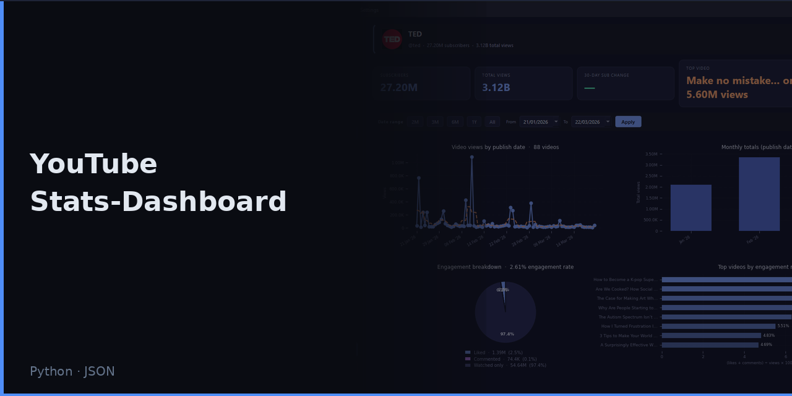
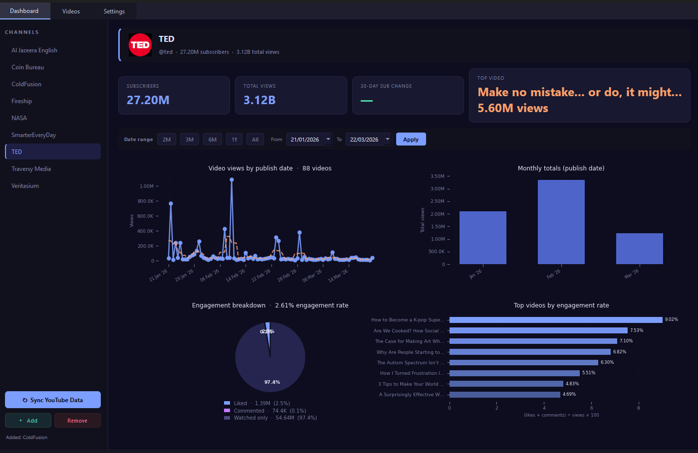
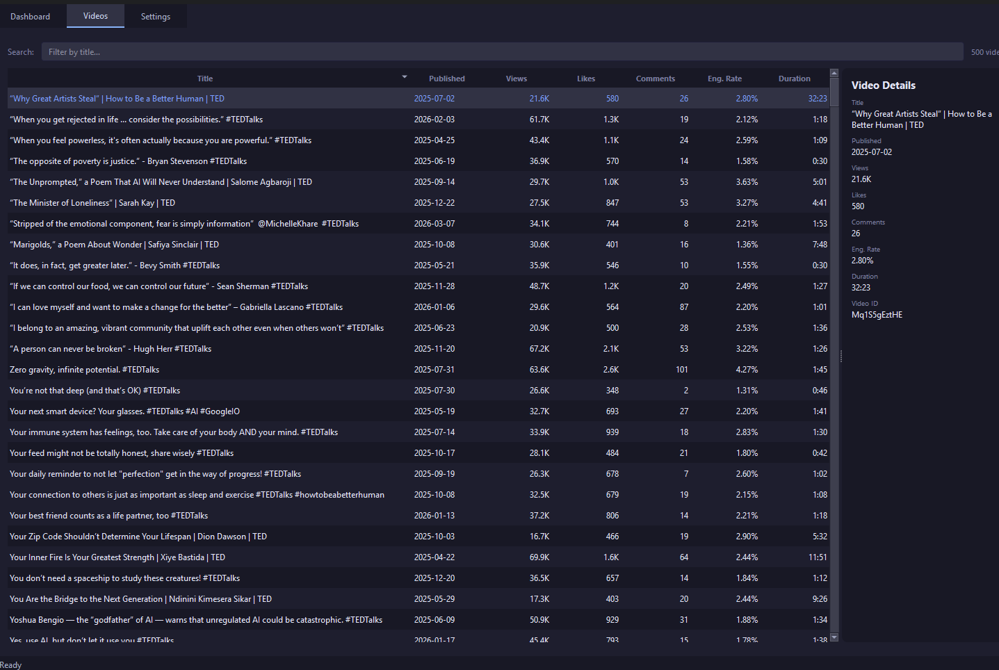

# YouTube Stats Dashboard

> Multi-channel YouTube analytics desktop app — persistent snapshots, sortable video tables, growth charts, and engagement breakdowns. All local, no third-party dashboard.



Built by [Naadir](https://github.com/Naadir-Dev-Portfolio)

---

## Screenshots





---

## Overview

YouTube Analytics is opaque, time-limited, and locked to the browser. This tool connects directly to the YouTube Data API v3, stores everything in a local SQLite database, and gives you a proper desktop interface for tracking channel growth over time. Add multiple channels, snapshot subscriber and view counts on demand, drill into per-video engagement rates, and review historical trends — all without touching the YouTube website.

---

## Architecture

```
YouTube-Stats-Dashboard/
├── main.py                    # Entry point, first-launch setup dialog
├── requirements.txt
│
├── app/
│   ├── config.py              # Paths, constants, api_config.json I/O
│   │
│   ├── api/
│   │   ├── youtube_client.py  # YouTube Data API v3 wrapper (quota-aware)
│   │   └── quota_tracker.py   # Daily quota tracker (10,000 units/day)
│   │
│   ├── db/
│   │   ├── database.py        # SQLite connection and schema migrations
│   │   └── models.py          # Data access layer (channels, snapshots, videos)
│   │
│   ├── workers/
│   │   └── fetch_worker.py    # QThread workers — non-blocking API calls
│   │
│   └── ui/
│       ├── chart_utils.py     # Shared matplotlib figure factory (Midnight Indigo theme)
│       ├── dashboard_tab.py   # Channel sidebar, stat cards, date filter, 2×2 chart grid
│       ├── videos_tab.py      # Sortable video table with detail panel
│       └── settings_tab.py    # API key entry, quota display
│
└── data/                      # Auto-created at runtime (gitignored)
    ├── youtube_stats.db
    └── quota.json
```

---

## Features

**Dashboard** — channel sidebar with add/remove controls, stat cards (subscribers, total views, 30-day delta, top video), date range filter with presets, and a 2×2 chart grid: video views line chart, monthly publish activity, engagement breakdown pie, and top videos by engagement rate. Hover tooltips on all charts.

**Videos tab** — full sortable/filterable table of every tracked video (title, published date, views, likes, comments, engagement rate, duration); clicking a row opens a detail panel

**Settings tab** — API key storage (gitignored `api_config.json`), live quota meter, data directory info

**Data layer** — SQLite with three tables (`channels`, `channel_snapshots`, `videos`); quota guard blocks fetches above 8,000 units/day

**Non-blocking** — all API calls run in `QThread` workers; status bar shows live progress; UI never freezes

---

## Tech Stack

`Python` · `PyQt6` · `YouTube Data API v3` · `matplotlib` · `SQLite`

---

## Setup

```bash
pip install -r requirements.txt
python main.py
```

On first launch you will be prompted for a YouTube Data API v3 key. Get one from [Google Cloud Console](https://console.cloud.google.com/) under **APIs & Services → Credentials**. Enable the **YouTube Data API v3** on the same project.

The key is saved to `api_config.json` (gitignored). You can update it any time from the Settings tab.

---

## Database schema

| Table | Key columns |
|---|---|
| `channels` | `channel_id`, `title`, `handle`, `thumbnail_url` |
| `channel_snapshots` | `channel_id`, `fetched_at`, `subscribers`, `total_views`, `video_count` |
| `videos` | `channel_id`, `video_id`, `title`, `published_at`, `views`, `likes`, `comments`, `duration_seconds` |

---

## API quota

The YouTube Data API has a 10,000 unit/day quota. Each channel fetch costs roughly `1 + ceil(videos/50) + ceil(videos/50)` units. The app tracks daily usage in `data/quota.json`, warns at 8,000 units, and blocks further fetches to protect the budget. The counter resets automatically at the start of each new day.

---

<sub>Python · Desktop</sub>
