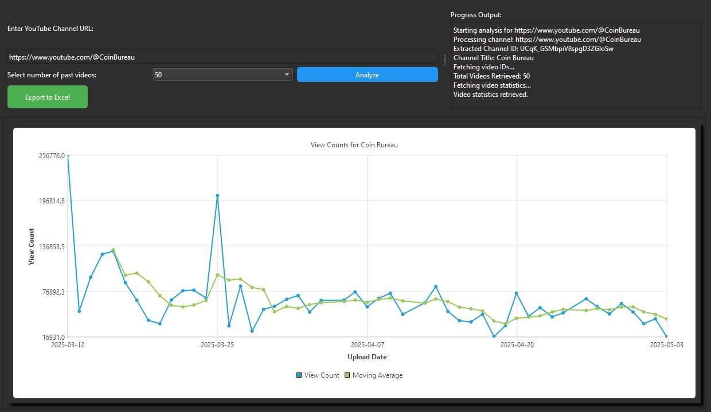

# YouTube View Stats Dashboard

> PyQt6 desktop dashboard for YouTube channel analytics with Google API integration and Excel export.

[](https://www.python.org/)
[](https://www.riverbankcomputing.com/software/pyqt/)
[](https://developers.google.com/youtube)

---

## Overview

The YouTube View Stats Dashboard is a powerful desktop application built with PyQt6 that provides detailed analytics and insights into YouTube channel performance. Leveraging the YouTube Data API, this application allows content creators and analysts to track view statistics, monitor channel growth, and export data for further analysis.

The dashboard features multi-threaded API calls for responsive performance, advanced chart visualizations, and comprehensive Excel export capabilities. Users can specify YouTube channel URLs in multiple formats (@handle, /c/, /channel/, or /user/), and the application automatically resolves them to channel IDs, fetches real-time statistics, and presents them in an intuitive interface.

---

## Features

- Query YouTube channels by URL (supports @handle, custom URLs, and channel IDs)
- Fetch real-time view statistics from YouTube Data API
- Multi-threaded API calls for responsive UI
- Interactive line charts with PyQt Charts
- Comprehensive Excel export with formatted charts
- Date filtering capabilities
- Professional dark-themed UI
- Logging for debugging and monitoring
- URL validation and channel resolution

---

## Screenshots

> Drop screenshots into `screens/` and reference them below.



---

## Getting Started

### Prerequisites

- Python 3.8 or higher
- PyQt6
- Google API Client
- Pandas
- OpenPyXL
- YouTube Data API key

### Installation

```bash
git clone https://github.com/Naadir-Dev-Portfolio/Desktop-youtube-view-stats-dashboard.git
cd Desktop-youtube-view-stats-dashboard
pip install -r requirements.txt
```

### Configuration

1. Obtain a YouTube Data API key from the Google Cloud Console
2. Create an `api.txt` file in the project directory
3. Paste your API key into the file (keep it private!)

```bash
echo “YOUR_YOUTUBE_API_KEY” > api.txt
```

### Run

```bash
python main.py
```

---

## Tech Stack

- PyQt6 — Modern desktop UI framework
- YouTube Data API — Channel and view statistics
- PyQt Charts — Interactive data visualization
- Pandas — Data manipulation
- OpenPyXL — Excel report generation
- Python — Core application logic

---

## Related Projects

- [Desktop-Mortgage-overpayment-tracker](https://github.com/Naadir-Dev-Portfolio/Desktop-Mortgage-overpayment-tracker)
- [Desktop-PyQt6-finance-dashboard](https://github.com/Naadir-Dev-Portfolio/Desktop-PyQt6-finance-dashboard)
- [Desktop-PyQt6-health-dashboard](https://github.com/Naadir-Dev-Portfolio/Desktop-PyQt6-health-dashboard)
